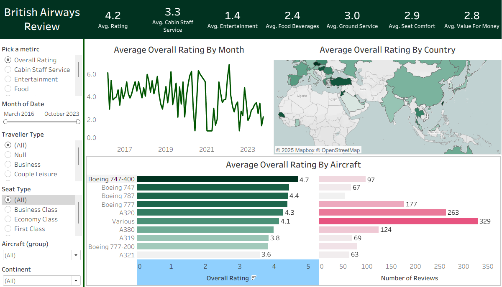

# British Airways Review Dashboard – Tableau Project

## Project Overview
This Tableau project analyzes British Airways customer reviews from March 2016 to October 2023, focusing on passenger sentiment, service experience and satisfaction trends. The dashboard helps identify performance patterns across countries, aircraft types, traveler categories and time periods, enabling data-driven insights into airline service quality.

## Problem Statement
Airlines receive thousands of customer reviews, yet understanding patterns across time, locations and traveler types is challenging. This dashboard solves that by bringing together review scores, traveler attributes and aircraft information into a single analytics view. It helps stakeholders identify what influences passenger satisfaction and where improvements can be made.

## Dataset Description
### ba_reviews.csv (Main Reviews Dataset)
Contains detailed customer reviews with the following columns:
| Column Name         | Description                      |
| ------------------- | -------------------------------- |
| header              | Review header/title              |
| author              | Reviewer name                    |
| date                | Review date                      |
| place               | Reviewer country                 |
| content             | Review text                      |
| aircraft            | Aircraft type used               |
| traveller_type      | Business, Leisure, Solo, etc.    |
| seat_type           | Economy, Business, First Class   |
| route               | Flight route                     |
| date_flown          | When the reviewer travelled      |
| recommended         | Yes/No (reviewer recommendation) |
| trip_verified       | Verified trip flag               |
| rating              | Overall rating score             |
| seat_comfort        | Rating of seating comfort        |
| cabin_staff_service | Rating of cabin crew service     |
| food_beverages      | Food & drink rating              |
| ground_service      | Ground staff rating              |
| value_for_money     | Value for money rating           |
| entertainment       | In-flight entertainment rating   |

### Countries.csv (Country Metadata)
Provides additional details for geographical mapping:
| Column Name | Description           |
| ----------- | --------------------- |
| Country     | Country name          |
| Code        | Country code          |
| Continent   | Continent name        |
| Region      | Region classification |

## British Airways Review Dashboard.hyper (Dashboard Preview)
Tableau data extract combining all processed data for visualization.

## Key Dashboard Metrics (KPIs)
The Tableau dashboard displays the following averages:
- Average Overall Rating
- Avg. Cabin Staff Service Rating
- Avg. Entertainment Rating
- Avg. Food & Beverages Rating
- Avg. Ground Service Rating
- Avg. Seat Comfort Rating
- Avg. Value for Money Rating

## Dashboard Filters / Controls
Users can interact through:
- Pick a Metric:
     * Overall Rating
     * Cabin Staff Service
     * Entertainment
     * Food & Beverages
     * Ground Service
     * Seat Comfort
     * Value for Money
- Month of Date: March 2016 → October 2023
- Traveller Type: Business, Solo, Couple, Family, etc.
- Seat Type: Economy, Premium, Business, First Class
- Aircraft Group: All aircraft models used by British Airways
- Continent: Europe, Asia, Africa, etc.

## 📈 Dashboard Visuals
- Average Overall Rating by Month
   * A line chart showing trends over 7+ years
   * ECG-like pattern displaying satisfaction fluctuations
   * Shows seasonal dips and improvements
- Average Overall Rating by Country (Geo Map)
   * Color-coded world map
   * Helps identify countries with best/worst service experience
- Rating by Aircraft Type (Vertical Bars)
   * Shows rating differences between aircraft
   * Includes: Overall Rating
   * Number of Reviews
- Additional Insights (in KPIs + Charts)
   * Review counts
   * Traveler behavior
   * Seat type preferences
   * Regional service patterns

## Key Insights
- Countries in Europe and the Middle East show higher average ratings than others.
- First Class and Business Class generally receive better ratings than Economy.
- Cabin staff service strongly influences overall satisfaction.
- Certain aircraft types consistently score higher, indicating better comfort or service.
- Seasonal patterns indicate periodic dips in customer satisfaction.

## Tools & Technologies
- **Tableau Desktop** – Dashboard creation
- **Tableau Prep / Tableau Extract (.hyper)** – Cleaning & modeling
- **CSV Data Files** – Source datasets
- **GitHub** – Project hosting

## Files in This Repository
| File Name                                | Description                       |
| ---------------------------------------- | --------------------------------- |
| `British Airways Review Dashboard.hyper` | Tableau data extract              |
| `ba_reviews.csv`                         | Main review dataset               |
| `Countries.csv`                          | Country metadata dataset          |
| `dashboard.png`                          | Screenshot of the final dashboard |
| `README.md`                              | Project documentation             |

**Download Dashboard** 
https://github.com/sunilprajapati832/British-Airways-Review-Tableau-Dashboard/blob/main/British%20Airways%20Review%20Dashboard.hyper

**License** This project is licensed under the MIT License (Attribution Required). If you use any part of this project, please give proper credit to the author – Sunil Prajapati.

**If You Like This Project** Please star **⭐** this repository — it helps support my work and increases visibility!

## Connect with Me 🤝
If you found this project interesting, let’s connect!  
 
